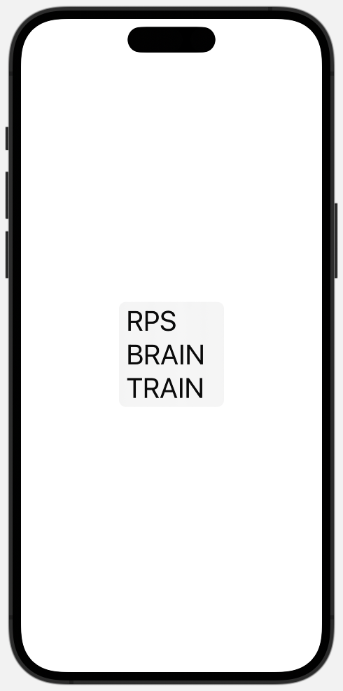
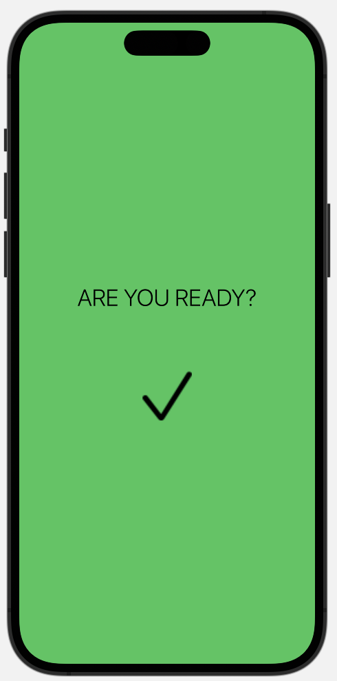
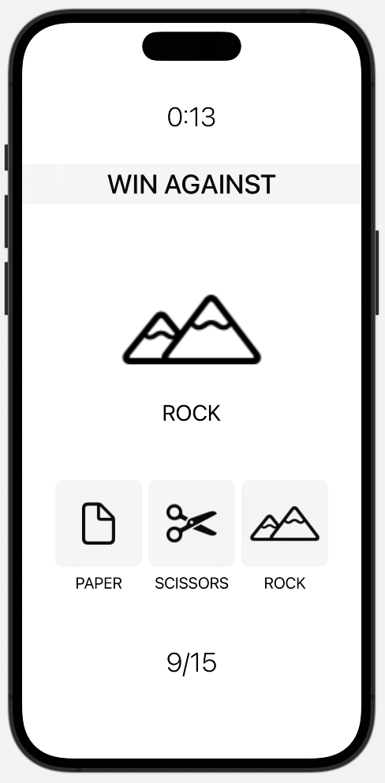
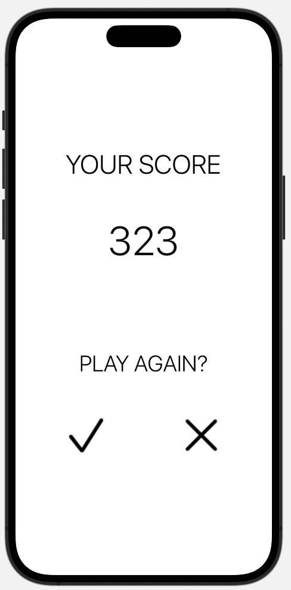

# RPS Brain Train

<div style="display: flex; justify-content: center; width: 100%">
  
  
  
  
</p>

### A brain training SwiftUI app, built with a clean and minimalistic design, intended for IOS devices.

## Description

RPS or 'Rock, paper, scissors' Brain Train is an intuitive IOS brain trainer built with SwiftUI to enhance users decision making skills and recall. The game portion of RPS Brain Train is based on rock paper scissors against the computer, however the computers' choice is already made evident to the user, along with the prompt to either win, lose or draw. The user must then make a decision based on the information provided, and then click the corresponding item to to achieve this result. There is a timer to add a sense of urgency, and the user is given a score based on how many correct decisions and how long it takes to make them. The score is revealed at the end of the game, after which the user can then choose to play again, or to go back to the main menu.

<p align="center">
  <!--  -->
  image to go here
</p>

---

| Table of Contents               |
| ------------------------------- |
| [User Story](#UserStory)        |
| [Functionality](#Functionality) |
| [Technology](#Technology)       |
| [License](#License)             |
| [Contributors](#Contributors)   |
| [Links](#Links)                 |

---

## User Story

-   **As a user, I want to be able to play a game that is fun and engaging, and that will help me to improve my decision making skills.**
-   As a user, I would like this game to be based on a simple and universal concept, so that I can easily understand the rules and how to play.
-   Given that I have an IOS device, I would like to be able to play this game on my phone, so that I can play it anywhere and at any time.
-   As a user, I would like to be able to see my score at the end of the game, so that I can see how well I did.
-   As a user, I would like to be able to play the game again, so that I can try to beat my score.
-   As a user, the prompts and instructions should be clear and easy to understand, so that I can easily play the game.

## Functionality

This SwiftUI code file implements the game logic and UI of a Rock-Paper-Scissors game. The game allows the player to pick between "rock", "paper", or "scissors" and match it with the desired result ("win against", "draw with", or "lose to"). The game will keep track of the score and the number of rounds played, and will end either when the player runs out of time or reaches the maximum number of rounds.

```swift
    static let itemChoice = ["rock", "paper", "scissors"]
    static let randomResult = ["win against", "draw with", "lose to"]
    static let matchPairs = [
        "rock": ["win against": "paper", "draw with": "rock", "lose to":"scissors", "symbol":"mountain.2"],
        "paper": ["win against": "scissors", "draw with": "paper", "lose to":"rock", "symbol":"doc"],
        "scissors": ["win against": "rock", "draw with": "scissors", "lose to":"paper", "symbol":"scissors"],
    ]
```

The itemChoice array and the randomResult array hold the options for the player's choice and the desired result, respectively. The matchPairs dictionary maps the possible combinations of choices and desired results to their outcome ("win against", "draw with", or "lose to").

```swift
    @State private var shuffledItemsArr = itemChoice.shuffled()
    @State private var shuffledResultsArr = randomResult.shuffled()
    @State private var shuffledSingleItem = itemChoice.shuffled()[0]
    @State private var rightChoice = "";
    @State private var numberOfRounds = 1;
    @State private var timeRemaining = 30;
    @State private var readyToPlay = false;
    @State private var gameHasEnded = false;
    @State private var score = 0;
```

The state variables hold the current state of the game, including the shuffled arrays of choices and desired results, the player's choice and desired result, the number of rounds played and the time remaining, the game status (whether it is ready to play or has ended), the score, and various UI elements.

```swift
        private let timer = Timer.publish(every: 1, on: .main, in: .common).autoconnect()

```

The timer constant is a Timer object that is set to publish events every second on the main thread.

## Technology

-   Swift/SwiftUI
-   Xcode IDE
-   SFSymbols

## License

[](https://opensource.org/licenses/MIT)

## Future Developments

-

## Contributions

This was a solo project :)

## Links

#### Github Repo

https://github.com/A11AN0/RPS-Brain-Train

#### Thanks for reading!-Allan :)
